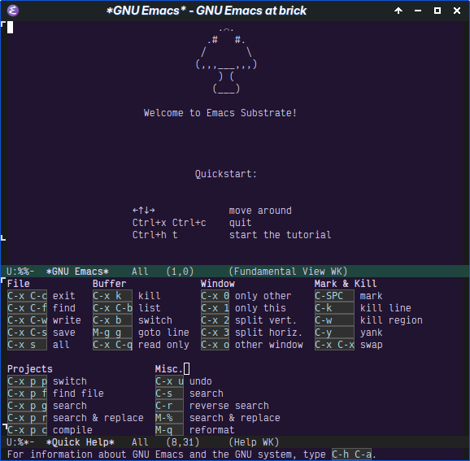

# Emacs Substrate

A clean basis to organically grow your config onto.

**NOTICE:** Requires Emacs 29.1 or better.

## Description

This is a minimal Emacs base config. Here's the short of the philosophy:

 - Focus on using default, built-in Emacs behaviour
 - Emacs-lisp centric, encourage configuration through code
 - Provide an upgrade path for Substrate
 - Stay minimal, only include as little packages and config as possible
 - Keep to the project vision, even though users are free to turn features off

## Installation

### With automated script

Copy and paste the following into a terminal:

```
curl 
```

### Manually

To install emacs-substrate, clone this repository somewhere, then create the following 2 files:

```lisp
;; ~/.emacs.d/early-init.el
(add-to-list 'load-path "<path-where-emacs-substrate-was-cloned>")

(require 'early-substrate)
```

```lisp
;; ~/.emacs.d/init.el
(require 'substrate)

;; Set custom variables here

(substrate-init)

;; The rest of your config below
```

## Screenshots

What you should see on opening Emacs up with Substrate installed: a simple splash screen, [modus-vivendi](https://protesilaos.com/emacs/modus-themes) active, and the `help-quick` display at the bottom.



Basic code editing: line numbers and `hl-line-mode`.


## Philosophy

TODO

## Requirements

Emacs 29.1 or later.

Emacs 29.1 is, as of 2023-09-04, the latest stable release. The specific features from Emacs 29.1 that Substrate relies on are:

 - The `use-package` macro for configuration
 - Enhancements to the built-in completion help (`completions-auto-select`, `completion-auto-help`, etc.)
 - Built-in tree-sitter support
 - Built-in LSP client (Eglot)

## Credits

This project is a radical fork of [Emacs-bedrock](https://codeberg.org/ashton314/emacs-bedrock)

Maintainer of Emacs-substrate:

- [Gene Pasquet](https://github.com/Etenil)

Creator and maintainer of Emacs-bedrock:

 - [Ashton Wiersdorf](https://lambdaland.org)
